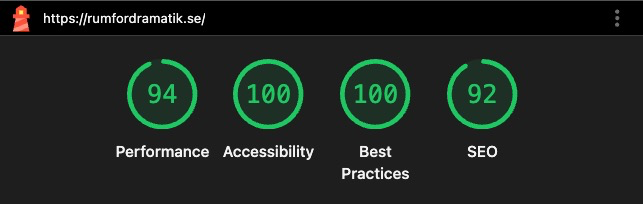

# Rum för Dramatik 🎭

The official digital platform for Rum för dramatik, Sweden's only magazine dedicated exclusively to newly written drama.

This application is more than just a website; it is a digital stage and archive that connects playwrights, readers, and theater enthusiasts. It serves as a subscription portal, a submission system for new scripts, and a browsable library of past issues.


[Visit the published live version here](https://rumfordramatik.se/)


## 🔍 Project overview

The purpose of this project was to develop a dedicated digital hub for the newly established drama magazine, **Rum för dramatik**. Previously, the magazine was distributed physically with a digital presence limited to Instagram. While social media is a tool for engagement, the publication needed a permanent anchor to reach a wider audience outside of algorithms.

The website brings value by solving three core logistical problems:

* **Discoverability & Archiving:** It provides a structured space for an archive of previous issues, themes, and synopses. It also serves as a professional landing page for press and institutions.
* **Streamlined Submissions:** A key feature is the "Open Call" system. The site hosts a submission form for playwrights to submit texts, replacing manual email threads.
* **Autonomy:** The site is built with a user-friendly Content Management System (CMS), empowering editors to update the site (e.g., publishing news, managing submissions) without developer intervention.
## ✨ Features

### 📚 The Digital Archive
* **Issue Browser:** A visual grid layout displaying past and present issues of the magazine.
* **Single Issue View:** Dedicated pages for each issue containing editorial summaries, contributor lists, and purchase options.
* **Dynamic Routing:** Seamless navigation between the archive and individual issues using React Router.

### 📝 Interactive Forms & Submissions
* **Open Call Submission:**
    * Allows playwrights to upload scripts (PDF/Word) directly.
    * **File Validation:** Checks file types and sizes *before* upload to save bandwidth.

* **Order & Subscription:**
    * **Conditional Logic:** Address fields only appear if "Home Delivery" is selected.
    * **Smart Autocomplete:** Attributes like `given-name` and `shipping address` help browsers fill data correctly without overwriting unrelated fields.

* **Newsletter Signup:**
    * Integrated with Mailchimp/WordPress.
    * Handles "Already Subscribed" states gracefully with a custom warning UI instead of a generic error.

### 🛡️ User Experience & Engineering
* **Instant Feedback (Client-Side Validation):**
    * Forms validate in real-time (0ms latency). Users see "Missing Name" or "Invalid Email" immediately, preventing frustration and unnecessary server requests.
    * **"No-Nag" Logic:** Error messages disappear the moment a user starts typing valid data.
* **GDPR Compliance:**
    * Mandatory, unchecked-by-default consent checkboxes on forms for Open Call and Newsletter.
    * Direct linking to the integrity policy.
* **Robust Error Handling:**
    * **Theatrical 404 Page:** *"Du har letat dig fram till en scen som inte existerar..."*
    * **Global Error Boundary:** Catches critical app crashes (White Screen of Death) and renders a helpful UI that keeps the Navigation Header/Footer visible so users aren't trapped.
* **Anti-Spam Security:**
    * **Honeypot Fields:** Invisible inputs to trap bots.
    * **Time-Based Analysis:** Rejects submissions that are filled out inhumanly fast (<2 seconds).


## 🛠️ Tech Stack

<p align="left">
  
  
  
  
  
  
  
  
  
  
</p>

### Key Implementations
* **Data & CMS:** **Advanced Custom Fields (ACF)** used to model complex content structures and expose them via the WP REST API.
* **Routing:** React Router v6 using the modern **Data API** and `errorElement` boundaries.
* **Styling:** **SCSS Modules** combined with global Design Tokens.
* **State Management:** Heavy use of **Custom Hooks** (e.g., `useSubmitForm`) to separate logic from UI.
* **Forms & API:** **Headless Contact Form 7** integration for order processing and Open Call submissions. Mailchimp for subscriptions.
* **Validation:** Custom client-side validation logic without heavy external libraries.
## 📂 Project Structure

```text
src/
├── components/     # Atomic UI (Button, TextInput, Alert, Spinner)
├── hooks/          # Custom hooks (useSubmitForm, useIssues)
├── layouts/        # Global structure (MainLayout, Header, Footer)
├── models/         # TypeScript interfaces (Issue, OrderForm, API responses)
├── pages/          # Views (Archive, OpenCall, Order, ErrorPage)
├── services/       # API integrations (Contact Form 7, Mailchimp)
└── styles/         # Design System (Tokens, Typography, Mixins)
```
## 📦 Installation

1. **Clone the repository**

```bash
git clone [https://github.com/matildasoderhall/rumfordramatik.git](https://github.com/matildasoderhall/rumfordramatik.git)
cd rumfordramatik
```

2. **Install dependencies**

```bash
  npm install 
```

3. **Start development server**

```bash
  npm run dev
```
    
## 🎨 Design Philosophy
The site reflects the printed magazine's aesthetic:

* **Typography:** Strong use of condensed fonts for headlines to evoke a poster/theatrical feel.

* **Visuals:** "Sticker" elements (e.g., Application Submitted) that persist across screens.

* **Responsiveness:** Fluid layouts that adapt from mobile screens to desktop stages.
## 🌱 Lessons Learned

* **Headless Architecture:** Gained deep experience connecting a React frontend with a WordPress backend using the REST API and Advanced Custom Fields (ACF).
* **Modern React Router:** Implemented `createBrowserRouter` to enable robust error handling with `errorElement` and distinct routing logic.
* **Client-Side Validation:** Built a custom validation engine from scratch to handle complex logic (like conditional address fields) without relying on heavy libraries.
* **SCSS Modules:** Mastered the use of Desgin Tokens and CSS Modules to keep styles scoped and maintainable.
## 📸 Screenshots

<div align="center">
  <h3>Desktop & Mobile</h3>
  <table>
    <tr>
      <td valign="top"></td>
      <td valign="top"></td>
    </tr>
  </table>
</div>

### ⚡ Performance
<div align="center">
  
</div>

## 🤝 Credits

This project was developed as my graduation project at **Medieinstitutet** during my second year of studies. 

* **Design & Concept:** Rum för dramatik,  [@matildasoderhall](https://github.com/matildasoderhall)
* **Development:** [@matildasoderhall](https://github.com/matildasoderhall)


